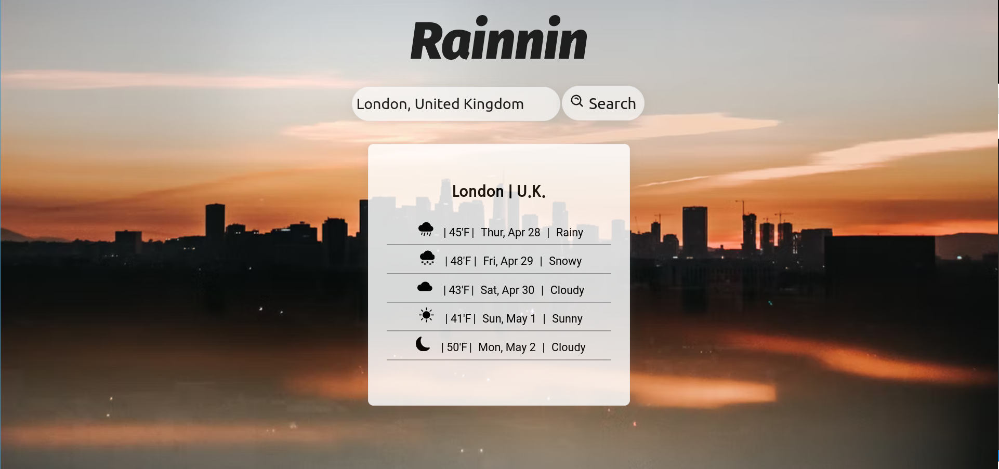

# Rainnin

Minimalist weather app created in React

## Why this app as created:

Proof of concept: This app was created as an example of React state, regular expressions, core Javascript functions and minimalist U.X design.

## How to use:

1. Clone repo into desired directory `git clone https://github.com/Toughee/Rainnin.git` or `gh repo clone Toughee/Rainnin`
2. Run `npm install` in your terminal to install all app node modules and dependencies
3. Run `yarn start` in your terminal to run app on http://localhost:3000/

## Testing / Linter tools used for app:

-   React Testing library and Jest for testing components
-   TravisCI and CircleCI for CI/CD development
-   Prettier for keeping all code formatted and organized

### Image reference

taken from Devin Avery from Unsplash.com
- [Devin Avery's Unsplash profile](https://unsplash.com/@devintavery)
- [Url for picture used in app](https://images.unsplash.com/photo-1517511620798-cec17d428bc0?ixlib=rb-1.2.1&ixid=MnwxMjA3fDB8MHxwaG90by1wYWdlfHx8fGVufDB8fHx8&auto=format&fit=crop&w=1170&q=80)